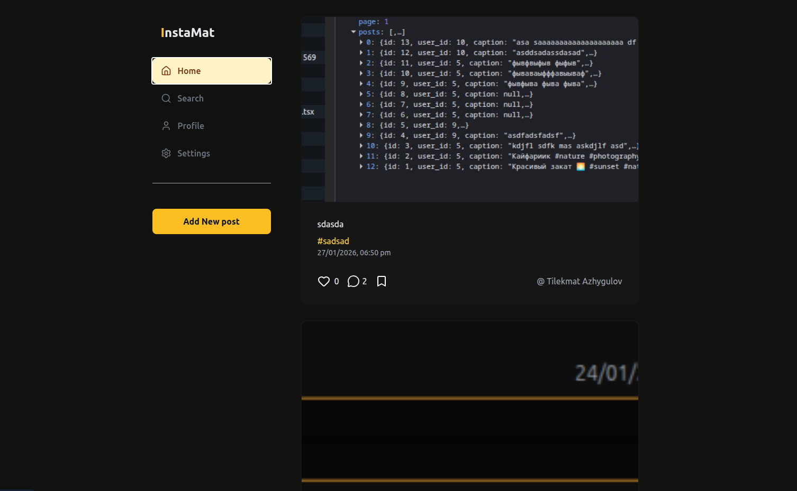

# InstaMat

A modern social media platform for sharing photos and connecting with friends. Inspired by Instagram, Twitter, and Twitch.

- https://insta-mat.netlify.app/
- https://github.com/manziro785/instamat-back

## Screenshots

-----
-----


## Features

### Authentication
- Email/Password registration and login
- Google OAuth integration
- JWT token-based security

### User Profiles
- Customizable username, name, and bio
- Avatar upload with Cloudinary
- Profile statistics (posts, followers, following)

### Posts
- Photo uploads with captions
- Hashtag support (automatic extraction)
- Edit and delete posts
- Like and save posts
- Infinite scroll feed

### Social Interactions
- Follow/unfollow users
- Like posts and comments
- Comment on posts
- Save posts to private collection

### Search & Discovery
- Search users by name or username
- Search posts by description
- Search and explore hashtags
- Sort posts by recent or popular

## Tech Stack

**Frontend**
- React 19.2.0
- TypeScript 5.9.3
- Vite 7.2.4

**State & Routing**
- TanStack Router 1.141.2
- TanStack Query 5.90.16
- Zustand 5.0.10

**UI & Styling**
- TailwindCSS 3.4.19
- Radix UI
- Lucide React (icons)

**Forms & Auth**
- React Hook Form 7.71.1
- Google OAuth
- Axios 1.13.2yourusername

**Development**
- Vitest (testing)
- TypeScript ESLint

## Getting Started

### Prerequisites
- Node.js 18+
- Google OAuth credentials

### Installation

1. Clone the repository
```bash
git clone https://github.com/yourusername/instamat.git
cd instamat
```

2. Install dependencies
```bash
pnpm install
```

3. Create `.env` file
```env
VITE_API_URL=your_backend_api_url
VITE_GOOGLE_CLIENT_ID=your_google_oauth_client_id
VITE_CLOUDINARY_CLOUD_NAME=your_cloudinary_cloud_name
VITE_CLOUDINARY_UPLOAD_PRESET=your_cloudinary_preset
```

4. Run development server
```bash
pnpm run dev
```

5. Open `http://localhost:5173`

## Scripts

```bash
pnpm run dev          # Start dev server
pnpm run build        # Build for production
pnpm run preview      # Preview production build
pnpm run lint         # Lint code
pnpm run format       # Format code
pnpm run check:fix    # Fix issues
```

## Project Structure

```
src/
├── pages/           # Page components
├── widgets/         # Complex UI components
├── features/        # Feature modules
├── entities/        # Business entities
├── shared/          # Shared utilities and components
└── app/            # App configuration
```


## Author

[@Tilekmat Azhygulov](https://github.com/manziro785)
